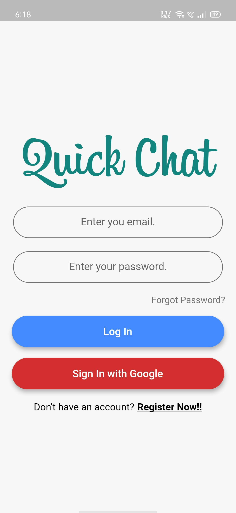
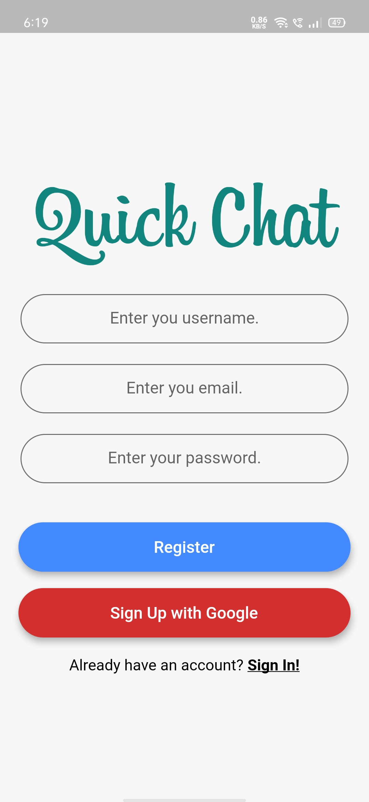
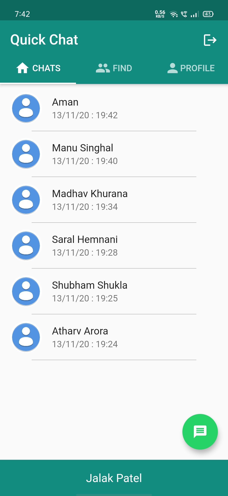
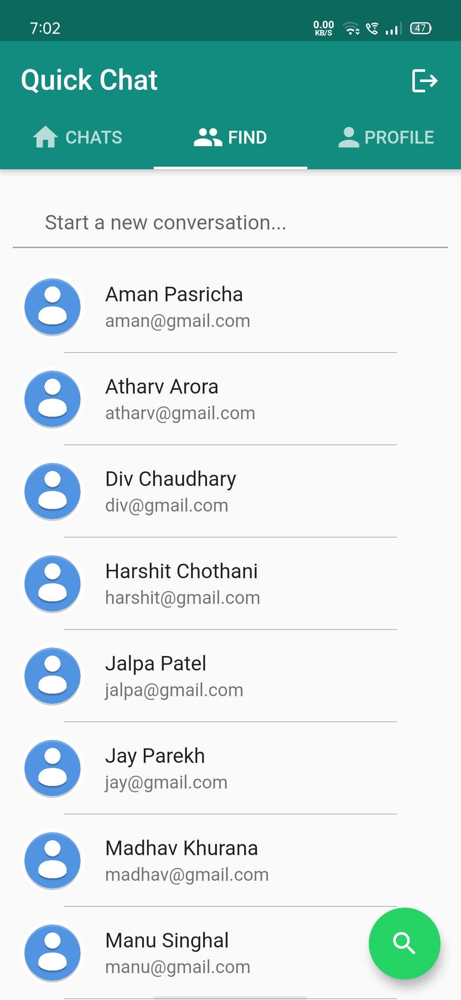
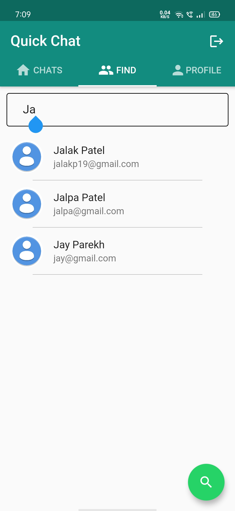
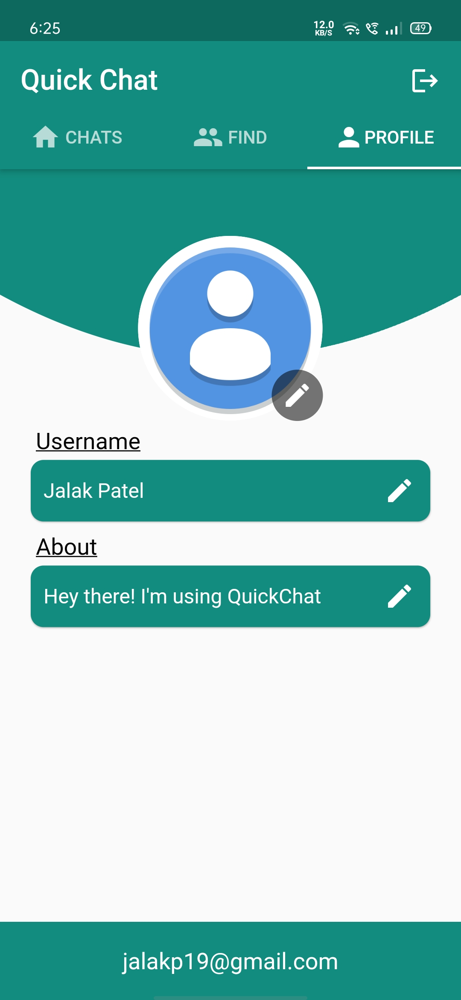
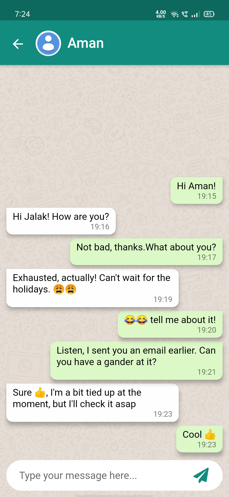

# Quick Chat

A Chat Application [WhatsApp Clone]

## Images

                  

## About

- Login Screen: You can login with email and password as well as google. Upon forgot password, you will be sent a password reset link
- Register Screen: You can register through email as well as google. You will be sent an email verification link. Once verified, only then you will be able to logIn
- Chat Screen: All your chats will be displayed here with the most recent chat at the top
- Find Screen: You can find all the user registered on the App here. The Search bar allows you to search and filter the user as you type the username.
- Profile Screen: You can always edit your Profile i.e Your Display picture, Username and About
- Chats: This is where you can send messages to your friends. Upon long press on any message, you will be alerted if you want to delete that message.

## Technologies Used

- Flutter
- Firebase
   - Firebase Auth (lib/services/auth.dart)
   - Cloud Firestore (lib/services/crud.dart)
   - Firebase Storage (To store profile pictures of users)
   
---
   
>Feel free to use the code in your own Flutter project

## Author

**- Jalak Patel (https://github.com/jalakp19)**

